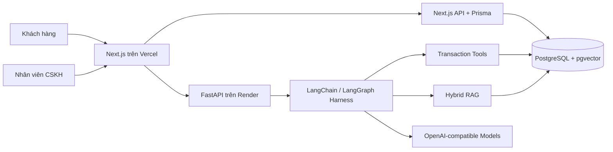
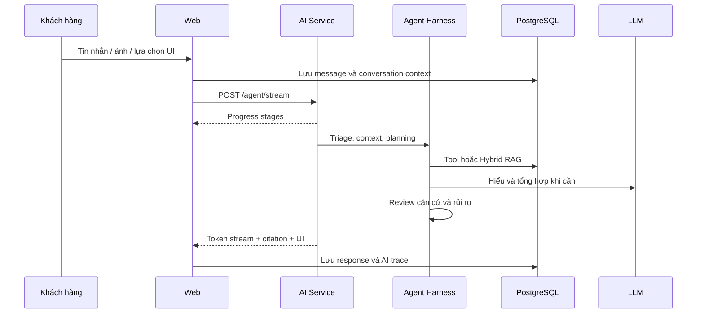

# OmniCare - Tổng đài hỗ trợ tự vận hành

OmniCare là nền tảng chăm sóc khách hàng đa tác vụ cho Track D - Automation/Agent. Hệ thống tiếp nhận hội thoại, hiểu yêu cầu tiếng Việt, truy xuất dữ liệu giao dịch và Knowledge Base, thực thi công cụ an toàn, phát token theo thời gian thực và chuyển tiếp đầy đủ ngữ cảnh cho nhân viên khi cần.

**Ứng viên:** Nguyễn Nhật Minh  
**Email:** ngynhaatminh@gmail.com  
**Điện thoại:** 0373973754

## Liên kết

- Sản phẩm: https://omnicare-chatagent.vercel.app
- AI health: https://omnicare-ai-service.onrender.com/health
- Báo cáo GFT: https://github.com/Minwsun/omnicare-gft-submission/releases/download/v1.0-gft/Nguyen_Nhat_Minh_OmniCare_GFT.pdf

## Khả năng chính

- Chat tự nhiên có nhớ ngữ cảnh, sửa lỗi chính tả và streaming từng phần.
- Hybrid RAG kết hợp full-text, vector, graph context, reranking và citation.
- Tool call cho tài khoản, đơn hàng, giao vận, thanh toán, hoàn tiền, đổi trả và sản phẩm.
- UI động do agent trả về: chọn đơn, chọn sản phẩm, nhập số lượng và xác nhận hành động.
- Triage yêu cầu hỏi đáp, khiếu nại, kỹ thuật, thanh toán, khẩn cấp, spam, trùng lặp và thiếu dữ liệu.
- Human handoff: tạo ticket, giữ nguyên lịch sử, nhân viên claim và tiếp tục cùng cuộc hội thoại.
- Admin quản lý Knowledge Base, archive/restore, ingestion progress, inbox và AI Runs.
- Vision attachment hỗ trợ phân tích ảnh bằng chứng mà không tự kết luận vượt quyền.

## Kiến trúc





## Cấu trúc mã nguồn

```text
apps/
  ai-service/
    app/                 FastAPI, agent harness, RAG, tools, worker
    Dockerfile
    requirements.txt
  web/
    prisma/              Schema, migrations, seed demo tối thiểu
    public/
    src/app/             UI và API routes Next.js
    src/components/      Chat widget và dynamic agent UI
    src/lib/             Auth, memory, handoff, Prisma
    package.json
docker-compose.yml       Chạy toàn bộ hệ thống local
render.yaml              Cấu hình AI service và PostgreSQL
.env.example             Danh sách biến môi trường không chứa secret
```

## Khởi chạy nhanh bằng Docker

Yêu cầu: Docker Desktop và Docker Compose.

```powershell
Copy-Item .env.example .env
```

Điền tối thiểu `POSTGRES_USER`, `POSTGRES_PASSWORD`, `LLM_BASE_URL`, `LLM_API_KEY` và các model trong `.env`, sau đó:

```powershell
docker compose up --build
```

- Web: http://localhost:3000
- AI health: http://localhost:8000/health

Khởi tạo dữ liệu demo:

```powershell
docker compose exec web npx prisma db seed
```

## Khởi chạy từng service

### Web

```powershell
cd apps/web
npm ci
npx prisma migrate deploy
npx prisma db seed
npm run dev
```

### AI service

```powershell
cd apps/ai-service
py -3.12 -m venv .venv
.venv\Scripts\Activate.ps1
pip install -r requirements.txt
uvicorn app.main:app --host 0.0.0.0 --port 8000
```

## Tài khoản demo

Các credential dưới đây chỉ dành cho môi trường demo:

| Vai trò | Email | Mật khẩu |
| --- | --- | --- |
| Admin | `admin@test.com` | `admin` |
| Khách hàng 1 | `user1@test.com` | `user` |
| Khách hàng 2 | `user2@test.com` | `user` |

## Hướng dẫn sử dụng

### Khách hàng

1. Đăng nhập và mở `Portal`.
2. Xem danh sách hoặc chi tiết đơn hàng tại tab `Đơn hàng`.
3. Mở chat, hỏi tự nhiên như “đơn nào của tôi sắp giao?” hoặc “tôi muốn trả hàng”.
4. Chọn đơn/sản phẩm từ card tương tác khi agent cần làm rõ.
5. Xác nhận các hành động thay đổi dữ liệu bằng hộp xác nhận.
6. Nhắn “tôi muốn gặp nhân viên” để chuyển toàn bộ hội thoại sang CSKH.

### Nhân viên/Admin

1. `Inbox`: nhận, claim, trả lời và đóng yêu cầu hỗ trợ.
2. `Knowledge`: thêm, sửa, archive, restore và theo dõi tiến độ index tài liệu.
3. `AI Runs`: xem intent, model, tool calls, retrieval, latency và kết quả từng lượt.
4. `Graph`: kiểm tra quan hệ dữ liệu và bằng chứng truy xuất.

## Dữ liệu mẫu

Seed tạo 2 khách hàng, 12 sản phẩm, 8 đơn hàng với nhiều trạng thái, payment/shipment/refund, 8 ticket và bộ KB Omni tự biên soạn. Toàn bộ tên và giao dịch đều hư cấu.

## Công nghệ

- Next.js 16, React 19, TypeScript, Prisma, Zod, Argon2.
- FastAPI, Pydantic, LangChain, LangGraph, asyncpg, psycopg, HTTPX.
- PostgreSQL, pgvector, Server-Sent Events, Docker.
- Vercel cho web; Render cho AI service và PostgreSQL.

## Bản quyền

Mã nguồn do Nguyễn Nhật Minh phát triển được phát hành theo MIT License. Dependency bên thứ ba giữ nguyên license riêng, xem [THIRD_PARTY_NOTICES.md](THIRD_PARTY_NOTICES.md). Repository không phân phối dữ liệu marketplace hoặc khóa bí mật.

